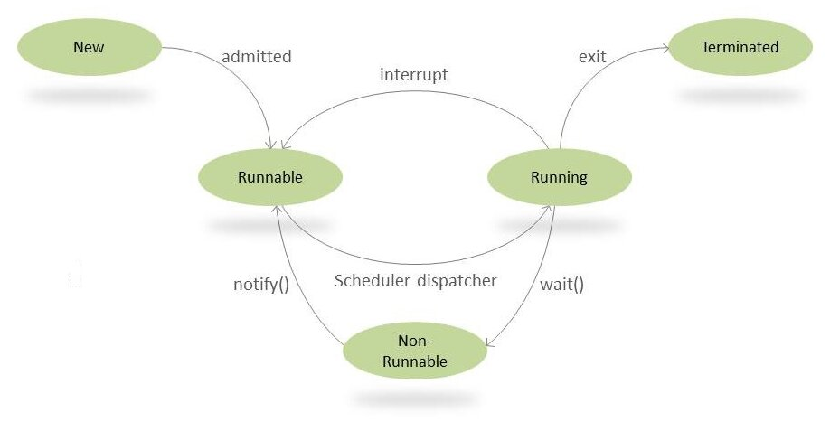
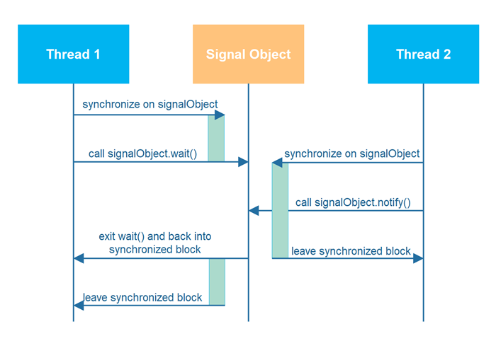

# Thread Fundamentals

## Thread Synchronization in Java

In a multithreaded environment, multiple threads might try to modify the same resource. Not managing threads properly
will of course lead to consistency issues.

We can better understand this from the following diagram depicting the life cycle of a Thread:



## Wait, Notify and NotifyAll in Java

The wait() and notify() are methods of the Object class. They were introduced to part ways with polling, which is the
process of repeatedly checking for a condition to be fulfilled. Polling wastes CPU resources considerably, hence it is
not preferred.

A thread that calls wait() on any object becomes inactive until another thread calls notify() or notifyAll() on that
object. In order to call either wait(), notify() or notifyAll(), the calling thread must first obtain the lock on that
object. In other words, the calling thread must call wait() or notify() from inside a synchronized block that is
synchronized on that object.

Below is an example class that can be used for two threads to pass signals.

```
public class MonitorObject{
}

public class MyWaitNotify{

  MonitorObject myMonitorObject = new MonitorObject();

  public void doWait(){
    synchronized(myMonitorObject){
      try{
        myMonitorObject.wait();
      } catch(InterruptedException e){...}
    }
  }

  public void doNotify(){
    synchronized(myMonitorObject){
      myMonitorObject.notify();
    }
  }
}
```

When the first thread calls doWait() it first enters a synchronized block and then calls wait() on an internal monitor
object. The synchronized block is synchronized on that monitor object. When wait() is called - the calling thread
releases the lock on the monitor object - and is blocked until another thread calls notify() or notifyAll() on the
monitor object.

When the second threads calls doNotify() it enters a synchronized block that is synchronized on the internal monitor
object. Inside this synchronized block the thread then calls the notify() method on the monitor object. This will wake
up one thread blocked inside a wait() call on the same monitor object. However, none of these awakened threads can exit
the wait() method until the thread calling notify() (or notifyAll()) has released the lock on the monitor object.

